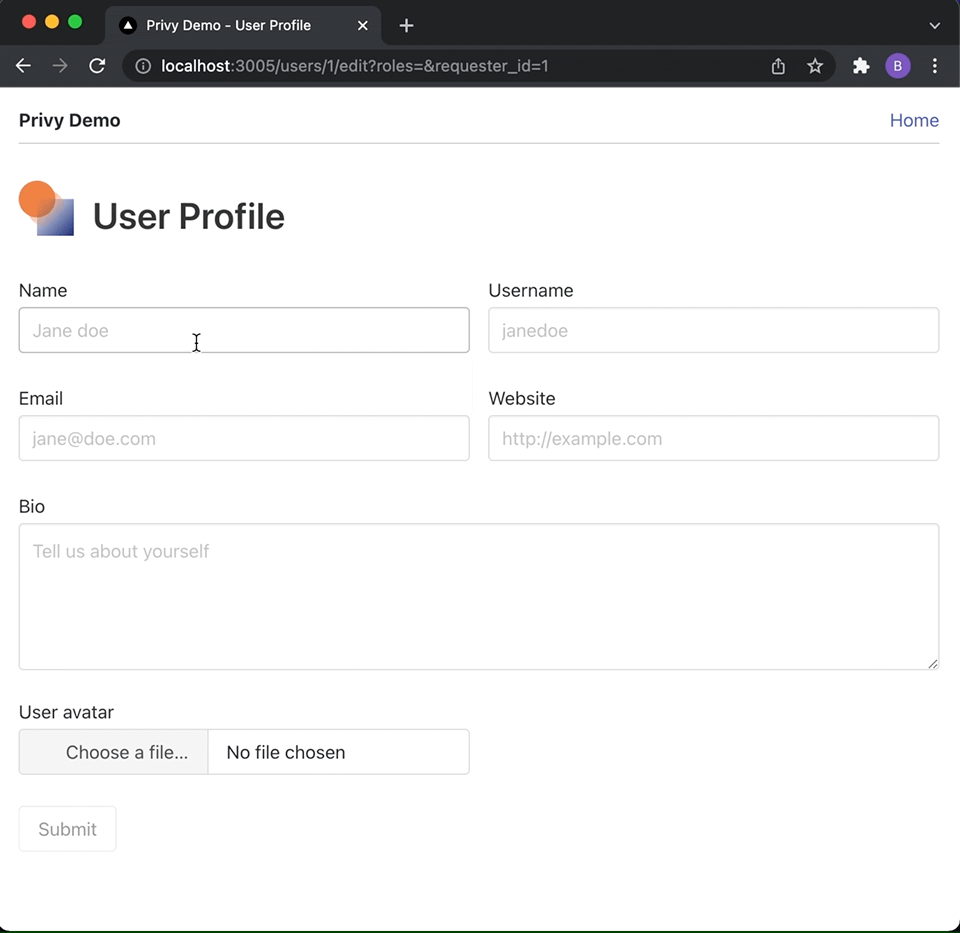

# Privy PII Demo

This [next.js](https://nextjs.org) app is a demo of integrating Privy for basic user PII.

This demo is intended to serve as a basic example for how to integrate privy-js in the browser. In particular, see index.tsx and edit.tsx in [pages/users/[id]](https://github.com/horkos-labs/privy-pii-demo/tree/main/pages/users/%5Bid%5D) for examples of saving and fetching user data with Privy.

All user data (form fields, file uploads) in this demo are end-to-end encrypted.



## Setup

```
git clone <repo>
cd <repo>
npm install
```

Copy `.env.example.local` to `.env.local`. In `.env.local`, update the variables with any configuration changes (e.g., your public and private keys from the Privy console).

Start the server.

```
npm run dev
```

Point your browser to `localhost:3005`
